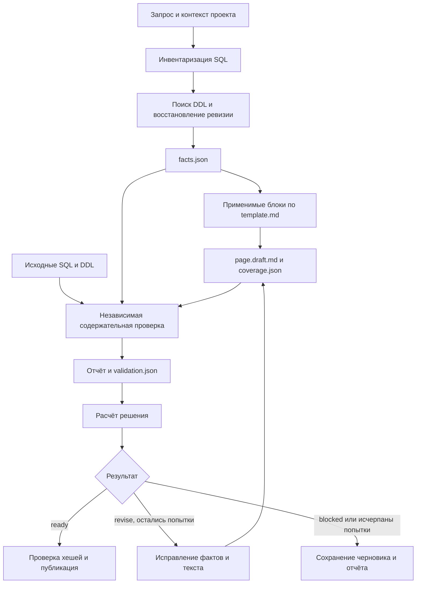

# Подробный обзор скилла wiki-doc

Дата обзора: 12 сентября 2026 года.

Объект обзора — пакет `wiki-doc` из каталога `C:/work/git/my-repos/wiki-doc/wiki-doc`. Описание подготовлено по текущему содержимому его инструкций, шаблонов, Python-кода, тестов и контрольных SQL-примеров. До создания этого обзора пакет содержал **46 файлов: 29 Markdown, 14 SQL, 2 Python и 1 JSON**.

`wiki-doc` задаёт агенту процесс создания и обновления wiki-документации SQL-объектов: от поиска определений и восстановления структуры до проверки черновика и сохранения страницы в локальную wiki. Он также описывает режимы ответов по существующей документации и её проверки.

Основная функциональность реализована **инструкциями для агента**. Исполняемый Python-компонент проверяет структуру отчёта валидации и вычисляет решение о готовности. В пакете нет самостоятельного SQL-парсера, программного генератора всей документации или отдельного движка публикации.

## Содержание

1. [Назначение и область применения](#назначение-и-область-применения)
2. [Структура пакета](#структура-пакета)
3. [Архитектура и распределение ответственности](#архитектура-и-распределение-ответственности)
4. [Режимы работы](#режимы-работы)
5. [Полный цикл генерации](#полный-цикл-генерации)
6. [Реестр фактов и карта покрытия](#реестр-фактов-и-карта-покрытия)
7. [Поиск определений: ddl-finder](#поиск-определений-ddl-finder)
8. [Создание разделов: doc-writer](#создание-разделов-doc-writer)
9. [Все шесть блоков шаблона](#все-шесть-блоков-шаблона)
10. [Содержательная проверка: doc-validator](#содержательная-проверка-doc-validator)
11. [Все функции Python-валидатора](#все-функции-python-валидатора)
12. [Идентичность страниц и публикация](#идентичность-страниц-и-публикация)
13. [Профиль CKR_GP и правила доступа](#профиль-ckr_gp-и-правила-доступа)
14. [Все контрольные SQL-сценарии](#все-контрольные-sql-сценарии)
15. [Все функции и методы тестового модуля](#все-функции-и-методы-тестового-модуля)
16. [Исторические отчёты и вынесенный оценщик](#исторические-отчёты-и-вынесенный-оценщик)
17. [Практическое использование и границы возможностей](#практическое-использование-и-границы-возможностей)
18. [Проверки при подготовке обзора](#проверки-при-подготовке-обзора)

## Назначение и область применения

Главная задача скилла — объяснять назначение, структуру, вычисления и движение данных по проверяемым источникам. В качестве оснований используются исходный SQL, DDL, порядок миграций, конфигурация проекта и явно атрибутированные комментарии.

DDL здесь — определения и изменения структуры объектов: например, `CREATE TABLE`, `ALTER TABLE`, объявления функций, ограничения и комментарии. Wiki — набор документирующих страниц с индексом и согласованными ссылками.

### Какие объекты описываются

| Объект | Основное содержание документации |
|---|---|
| Таблица | Колонки, типы, NULL/DEFAULT, ключи, ограничения, происхождение структуры |
| View | Выходные колонки, выражения, фильтры, источники и зависимости |
| Materialized view | Учитывается как отдельный вид объекта в поиске и реестре; отдельного специализированного шаблона в пакете нет |
| Функция | Сигнатура, параметры, возвращаемый результат, чтения, изменения, вызовы, формулы и условия |
| Процедура | Объявление и параметры, последовательность действий, зависимости и подтверждённые эффекты |
| Миграция | Переход структуры между состояниями, порядок применения и затронутые объекты |
| CTAS | Создание и заполнение таблицы через `CREATE TABLE AS SELECT`, структура результата запроса |
| Временные объекты и CTE | Промежуточные преобразования, область видимости, связи с физическими объектами; они не автоматически становятся отдельными wiki-страницами |

Функции только для чтения входят в область применения наравне с загрузочными функциями. Наличие `INSERT` не является условием документирования или проверки формул.

### Что получает пользователь

При генерации результатом становится страница Markdown с применимыми разделами, ссылками на источники и метаданными происхождения. При успешной валидации страница сохраняется в wiki, а индекс обновляется. Если публикация невозможна, сохраняются черновик и отчёт с конкретными причинами.

В режиме Query пользователь получает ответ по существующей wiki. В режиме Lint — отчёт о состоянии документации; исправления выполняются при запросе на исправление.

### Основные принципы

- Технические утверждения подтверждаются SQL/DDL выбранной ревизии.
- Бизнес-интерпретация отделяется от технического поведения и сопровождается основанием.
- Недостающие сведения фиксируются явно, без угадывания типов, имён и эффектов.
- Документируемый SQL и примеры вызовов не исполняются в рамках обычного документирования.
- Разные объекты одного SQL-файла имеют собственную идентичность и могут получать отдельные страницы.
- Ошибка исходного SQL и ошибка документации рассматриваются отдельно: точное описание проблемного SQL может пройти проверку.

Источник: [SKILL.md](C:/work/git/my-repos/wiki-doc/wiki-doc/SKILL.md).

## Структура пакета

```text
wiki-doc/
├── SKILL.md                           # Основной сценарий и режимы
├── ddl-finder.md                      # Поиск DDL и восстановление версии
├── doc-writer.md                      # Создание блока документации
├── doc-validator.md                   # Содержательная проверка и критерий готовности
├── doc-evaluator.md                   # Указатель на вынесенный скилл
├── template.md                        # Карта применимости и порядок блоков
├── project-profile.md                 # Условно подключаемый профиль CKR_GP
├── rules.md                           # Матрица доступа CKR_GP
├── REVIEW-FOLLOWUP.md                 # История замечаний и их исправления
├── REVIEW-VERIFICATION.md             # Отчёт о проверке исправлений
├── references/
│   └── facts.md                       # Контракт facts.json и coverage.json
├── template/
│   ├── 01-header-purpose.md           # Объект и назначение
│   ├── 02-schema-signature.md         # Работа, сигнатура, параметры
│   ├── 03-entities.md                 # Колонки, сущности, справочники
│   ├── 04-formulas-dependencies.md    # Формулы, зависимости, CTE
│   ├── 05-dataflow-diagram.md         # Диаграмма потока данных
│   └── 06-misc.md                     # Даты, ошибки, эффекты, примеры, ограничения
├── scripts/
│   └── validation_gate.py             # Проверка JSON-отчёта и расчёт решения
├── tests/
│   └── test_validation_gate.py        # Девять автоматических тестов
└── examples/
    ├── README.md                     # Порядок проверки скилла
    ├── context.sql                   # Общие определения для сценариев
    ├── 01_no_target_ddl.sql
    ├── 01_no_target_ddl.expected.md
    ├── 02_now_and_casts.sql
    ├── 02_now_and_casts.expected.md
    ├── 03_cte_temp.sql
    ├── 03_cte_temp.expected.md
    ├── 04_update_perform.sql
    ├── 04_update_perform.expected.md
    ├── 05_default_string.sql
    ├── 05_default_string.expected.md
    ├── 06_same_name_diff_schema.sql
    ├── 06_same_name_diff_schema.expected.md
    ├── 07_dynamic_sql.sql
    ├── 07_dynamic_sql.expected.md
    ├── 08_alter_migration.sql
    ├── 08_alter_migration.expected.md
    ├── 09_view_and_readonly.sql
    ├── 09_view_and_readonly.expected.md
    ├── 10_ctas.sql
    ├── 10_ctas.expected.md
    ├── 11_audit_access.sql
    ├── 11_audit_access.expected.md
    ├── baseline/
    │   └── orders.sql                # Исходное состояние для миграций
    └── migrations/
        ├── manifest.json             # Ревизия и явный порядок файлов
        └── 043_amount.sql            # Последующее изменение структуры
```

Наиболее важное разделение: `SKILL.md` управляет процессом, `template.md` определяет нужные разделы, отдельные блоки задают их формат, `references/facts.md` описывает передаваемые данные, а `doc-validator.md` определяет содержательную приёмку. Это позволяет использовать один контракт в нескольких этапах.

Наличие Python-тестов и SQL-примеров не означает, что вся генерация запускается одной командой. В пакете нет команды наподобие `wiki-doc generate`: последовательность исполняет агент, получивший инструкции.

## Архитектура и распределение ответственности

### Компоненты

| Компонент | Что получает | Что делает | Что возвращает или сохраняет |
|---|---|---|---|
| Основной агент по `SKILL.md` | Запрос, SQL-проект, wiki | Выбирает режим, организует анализ, сборку, проверки и публикацию | Факты, блоки, черновик, отчёты, итоговую страницу и индекс |
| `ddl-finder` | Объект, ревизию, диалект, корень проекта | Находит определения и восстанавливает структуру | Метаданные, статус разрешения, источники и неопределённости |
| `doc-writer` | Срез фактов, SQL/DDL, шаблон, путь страницы | Формирует применимый раздел | Markdown-фрагмент и карту покрытия |
| `doc-validator` | Черновик, полный реестр страницы, исходники и контекст | Независимо сверяет факты и документацию | Markdown-отчёт и JSON проверок |
| `validation_gate.py` | JSON проверок | Проверяет его структуру и считает метрики | JSON с решением `ready`, `revise` или `blocked` |

У `SKILL.md` YAML-шапка содержит `name` и `description`. У трёх ролевых файлов — `ddl-finder.md`, `doc-writer.md`, `doc-validator.md` — дополнительно указаны `level: project` и `tools: read-only`.

Эти поля описывают предполагаемую роль и доступ. В самом Python-коде пакета нет механизма, который интерпретирует эти шапки и принудительно ограничивает инструменты. При делегировании writer и validator возвращают результаты; сохранение файлов возложено на основного агента.

### Как связаны этапы



Схема показывает организацию работы, заданную инструкциями. Исполняемая реализация переходов между всеми узлами в пакете отсутствует. При исправлении фактов требуется обновить связанные блоки и карту покрытия, а затем повторить затронутые проверки.

### Какие источники за что отвечают

1. SQL/DDL выбранной ревизии подтверждает технические факты.
2. Реестр сохраняет результат анализа и связи между фактами.
3. `template.md` задаёт применимость разделов.
4. Файлы `template/` определяют форматы конкретных разделов.
5. `doc-validator.md` задаёт правила приёмки, а Python проверяет арифметику отчёта.

Повторение ошибки реестра в красивом тексте не считается успешной генерацией: валидатор должен обнаружить расхождение с исходным SQL.

### Возможность делегирования

Инструкции допускают поручать независимый поиск объектов и создание блоков субагентам. Делегирование необязательно; основной агент выполняет тот же алгоритм самостоятельно. Для небольшой страницы один агент может написать несколько блоков — шесть отдельных вызовов не требуются.

Важная оптимизация контекста: writer получает нужный срез реестра и пути к исходникам, а не многократно продублированные полные SQL и DDL. Валидатор при этом получает достаточный полный контекст для независимой проверки страницы.

## Режимы работы

### Генерация новой страницы

Пример запроса: «Документируй объект из указанного SQL-файла в выбранной wiki».

Агент определяет объект и его зависимости, ищет определения, формирует реестр, пишет применимые блоки, собирает черновик и проверяет его. После `ready` выполняется локальная публикация и добавление ссылки в индекс.

Если исходный файл содержит несколько объектов, сначала составляется их список. Для каждого объекта устанавливается отдельный ключ. Общий анализ разрешено переиспользовать, но рабочая директория запуска выделяется отдельно для каждой страницы.

### Обновление существующей страницы

Используется тот же цикл анализа и проверки, дополненный контролем текущей wiki. Исходные хеши страницы и индекса сохраняются до изменений, чтобы обнаружить параллельные правки.

Путь существующей страницы сохраняется, если её объект однозначно установлен. Запрос на обновление разрешает обычную замену сгенерированной страницы без повторного подтверждения только из-за существования файла. Ручные правки необходимо сохранить; неразрешённый содержательный конфликт оставляется в черновике с объяснением.

### Query

Этот режим предназначен для ответов по уже существующей документации. Агент ищет релевантные страницы через индекс, формулирует ответ и даёт ссылки на wiki и при необходимости исходный SQL.

При обнаружении противоречия между wiki и кодом расхождение указывается явно. Сам по себе вопрос не означает запрос на сохранение нового анализа или обновление страниц.

Query описан короткой процедурой. Собственного поискового индекса, векторной базы, алгоритма ранжирования или специальной команды поиска в пакете нет; используются доступные агенту средства чтения и поиска.

### Lint

Lint проверяет состояние документации по нескольким направлениям:

- разрешаются ли ссылки на страницы и источники;
- нет ли отсутствующих или дублирующихся ключей объектов;
- соответствуют ли сохранённые SQL/DDL-хеши текущим файлам;
- нет ли противоречий исходному коду;
- присутствуют ли применимые разделы;
- корректно ли описаны правила активного профиля.

Изолированная страница не объявляется ошибочной автоматически: её допустимость оценивается по назначению. По запросу проверки возвращается отчёт. Запрос на исправление дополнительно разрешает устранять найденные проблемы.

Отдельного программного линтера ссылок или wiki в текущем пакете нет. `validation_gate.py` не реализует перечисленные проверки Lint.

## Полный цикл генерации

### 1. Установление контекста

Агент определяет границы SQL-проекта, выходной wiki, её индекс и соглашения ссылок. Для существующей wiki сохраняется принятый формат; для новой Markdown-wiki основной сценарий рекомендует относительные ссылки.

Диалект, версия СУБД и документируемая ревизия устанавливаются по проекту. Неизвестная версия записывается как `unknown`. Наличие конструкции в SQL можно описать, но оно само по себе не подтверждает её совместимость с неизвестной версией среды.

Профиль CKR_GP включается только по признакам целевого проекта. Присутствие файлов профиля в пакете скилла не является достаточным основанием.

### 2. Инвентаризация SQL

Нужно различить выполняемые операторы, комментарии, строковые литералы, тела функций и динамические команды. Текст SQL внутри строки не становится самостоятельной выполняемой операцией без соответствующего контекста исполнения.

Для реальных операций фиксируются чтения, изменения, вызовы, порядок, условия и ветвления. Обход охватывает `FROM/JOIN`, подзапросы, CTE, `UPDATE FROM`, `DELETE USING`, `MERGE USING`, CTAS, `RETURN QUERY`, `SELECT`, `PERFORM`, `CALL` и вызовы внутри выражений.

DDL запрашивается для объединения читаемых и изменяемых объектов. Таблица назначения должна попасть в поиск даже тогда, когда она нигде не читается. Для вызываемой функции определение требуется, когда оно необходимо для сигнатуры, типов или подтверждения эффекта.

### 3. Подготовка реестра и рабочей области

Реестр сверяется с SQL до написания текста. Для каждой страницы явно задаётся `documented_object_ids`: какие именно объекты документируются, а какие определения нужны только как контекст.

Создаётся UUID-каталог `.tmp/<run_id>/` внутри выходной wiki. В нём сохраняются факты и данные о первоначальном состоянии страницы и индекса. Для ещё не существующего файла фиксируется отсутствие, чтобы позже отличить создание другим процессом от неизменного состояния.

### 4. Написание и сборка

Основной агент выбирает применимые разделы по `template.md`. Writer возвращает для каждого блока текст и сопоставление ID фактов разделам. Результаты сохраняются как `block_N.md` и `coverage_N.json`.

Из блоков собирается `page.draft.md`, а из карт — `coverage.json`. Все эти файлы находятся в каталоге запуска. Основная wiki-страница на этом этапе ещё не заменяется.

### 5. Проверка и исправления

Валидатор сначала независимо сверяет SQL с реестром, затем проверяет документацию по SQL/DDL и реестру. После составления JSON выполняется численный расчёт готовности.

При `revise` исправляются конкретные факты или фрагменты и повторяются затронутые проверки. На одну попытку генерации допускается не более трёх запусков валидатора. При `blocked` или третьем неуспешном запуске сохраняются черновик и отчёт; новый цикл автоматически не начинается.

### 6. Локальная публикация

После `ready` повторно проверяется неизменность входов и wiki. Подготавливаются страница, индекс и резервные копии. Запись в общий индекс должна быть сериализована, затем страница заменяется и индекс обновляется.

При частичной ошибке изменения этого запуска восстанавливаются из копий. После успешной проверки страницы и индексной ссылки очищается только рабочая директория данного запуска с предварительной проверкой абсолютного пути.

## Реестр фактов и карта покрытия

Источник: [references/facts.md](C:/work/git/my-repos/wiki-doc/wiki-doc/references/facts.md).

### Верхний уровень facts.json

Реестр — структурированное представление анализа. Контракт описан в Markdown; отдельной JSON Schema и программного валидатора самого `facts.json` в пакете нет.

| Поле | Назначение |
|---|---|
| `schema_version` | Версия формы реестра; в приведённой форме равна `1` |
| `dialect` | Название SQL-диалекта и версия |
| `profile` | Активный профиль либо `null` |
| `documented_object_ids` | Явная область документируемой страницы |
| `inputs` | Входные файлы и их SHA-256 |
| `objects` | SQL-объекты, идентичность и ссылки на объявления |
| `operations` | Выполняемые операции и связи чтения, изменения, вызова |
| `conditions` | Точные условия и связь с операциями |
| `formulas` | Вычисления и места применения |
| `columns` | Колонки, типы назначения и выражений, источники |
| `definitions` | Результаты поиска DDL и восстановления ревизии |
| `unknowns` | Неизвестные сведения, причины и влияние |

### Объекты и определения

Элемент `objects` содержит `id`, `kind`, `schema`, `name`, каноническую сигнатуру для функции или процедуры, `page_id` и `source_refs`. В перечислении `kind` предусмотрены `table`, `view`, `materialized_view`, `function`, `procedure`, `migration`.

Элемент `definitions` связывается с объектом через `object_id`. Он хранит статус разрешения, найденные файлы, ссылки на фрагменты, ревизию, порядок миграций и восстановленную структуру либо отдельно представленные варианты.

`source_ref` содержит путь относительно проекта, `start_line`, `end_line` и хеш файла. Номер строки без пути недостаточен: несколько определений могут находиться в разных файлах.

Контракт также требует различать временные объекты и CTE. При этом полный отдельный машинный формат для всех локальных сущностей не задан: описание этих связей остаётся частью структурирования анализа агентом.

### Операции

Каждому оператору назначается уникальный в снимке ID, например `op_001`. Этот ID повторно используется в блоках и карте покрытия одной генерации.

| Поле операции | Что должно содержать |
|---|---|
| `id`, `kind`, `source_refs` | Идентификатор, вид операции и точное место в SQL |
| `reads` | Объекты, данные которых участвуют в операции |
| `writes` | Объекты, строки или структура которых изменяются |
| `calls` | Вызываемые функции и процедуры |
| `scope`, порядок | Область видимости и положение в выполнении |
| `condition_ids` | Условия IF/CASE, циклов и обработчиков |
| `transforms` | Выражения, JOIN-ключи, фильтры, агрегация, дедубликация |
| `dynamic` | `false` либо описание динамической конструкции и неразрешённых частей |

Для одной таблицы допустимы одновременно `reads` и `writes`: например, UPDATE использует прежние значения и обновляет строки. Для DDL запись означает изменение структуры и не обязательно изменение строк.

Вызов не доказывает запись. Если в вызываемой функции действительно есть INSERT, его можно описать как подтверждённый эффект вызова с отдельной ссылкой на определение. Этот эффект не смешивается с прямыми операциями вызывающего объекта.

### Колонки и доказательства типов

`columns` включает `object_id`, `name`, `type_target`, `type_expression`, `expression`, `source_columns`, `nullable`, `default`, `description`.

Разделение двух типов принципиально. При вставке выражения `varchar(16)` в существующую колонку `varchar(64)` оба типа должны сохраниться. Объявление источника не заменяет определение назначения.

Основания типовых утверждений разделяются на объявление (`declaration`), правило выражения (`expression`), комментарий (`comment`) и неподтверждённую интерпретацию (`inferred`). Комментарий не является доказательством SQL-типа. Для каждого утверждения о типе требуются соответствующие evidence и ссылки на исходники.

Неизвестное значение в JSON записывается как `null` с объяснением в `unknowns`, а в Markdown — `unknown`. Если вычисления вообще нет, как у обычной объявленной колонки CREATE TABLE, тип выражения обозначается как неприменимый, а не неизвестный.

### Формулы, условия и неопределённости

Формула хранит ID, точное выражение, используемые поля, ссылки, условия и операции применения. Анализ охватывает арифметику, агрегаты и оконные выражения, а не только CASE.

Условия сохраняют точный SQL, порядок ветвей, границы интервалов и семантику NULL. Условно выполняемая операция не должна превращаться в безусловный шаг при пересказе.

Неопределённость содержит собственный ID, неизвестный факт, причину, связанные факты и влияние на описание. Неизвестное динамическое имя и отсутствующий DDL колонок — разные виды ограничений, их следует объяснять отдельно.

### coverage.json

Карта покрытия связывает ID фактов с реальными разделами страницы. Например:

```json
{
  "op_001": ["Зависимости", "Схема работы"],
  "formula_001": ["Расчётные формулы"],
  "unknown_001": ["Неопределённости"]
}
```

Карта отвечает на вопрос, где описан факт. Она не доказывает, что описание верно. Валидатор должен прочитать соответствующий текст и сопоставить его с исходниками. Служебные ID можно не показывать читателю итоговой страницы.

## Поиск определений: ddl-finder

Источник: [ddl-finder.md](C:/work/git/my-repos/wiki-doc/wiki-doc/ddl-finder.md).

### Назначение и вход

`ddl-finder` находит определения SQL-объектов и изменения схемы, затем восстанавливает метаданные на выбранную ревизию. Он получает корень проекта, объект со схемой и типом, ревизию, диалект, активный профиль и, если известен, порядок миграций.

Работа ограничена чтением файлов. Это ролевая инструкция; Python-функции с именем `ddl_finder()` в пакете нет.

### Поиск кандидатов

Алгоритм состоит из пяти обязательных смысловых действий:

1. Найти файлы, имя которых похоже на имя объекта. В CKR_GP можно начинать с соглашений loader и `001create_table`.
2. Независимо от успеха первого шага выполнить поиск по содержимому всего проекта. Найти CREATE, ALTER, COMMENT, DROP/RENAME, ограничения и индексы.
3. Проверить схему, вид объекта, quoting, `CREATE OR REPLACE`, `IF NOT EXISTS` и `search_path` по SQL.
4. Прочитать определения в документируемом файле, миграциях и подключаемых файлах сборки.
5. Отделить активные определения от архивов, тестов, uninstall- и down-миграций и зафиксировать основание выбора.

Поиск по имени ускоряет работу, но не подтверждает полноту. Например, найденный `orders.sql` не отменяет необходимость прочитать последующие ALTER в файлах с числовыми именами.

Для view и CTAS извлекаются выходные колонки и выражения. Если для типа результата нужны определения источников, поиск продолжается по зависимостям. Посещённые объекты отслеживаются, чтобы циклические ссылки не приводили к бесконечному обходу.

### Восстановление состояния на ревизию

Сначала определяется, описывается ли готовый снимок схемы или состояние после набора миграций. Порядок берётся из manifest, changelog, сборки либо подтверждённого соглашения проекта.

Номера и даты в именах допустимы как порядок только при наличии такого соглашения. Время изменения файла, порядок файловой выдачи и момент checkout порядком миграций не являются.

| Изменение | Как меняется модель структуры |
|---|---|
| `ADD` | Добавляется колонка или иной элемент |
| `DROP` | Удалённый элемент исключается из итогового состояния |
| `RENAME` | Имя переносится; старое не остаётся второй самостоятельной колонкой |
| `ALTER TYPE` | Заменяется тип на выбранном шаге |
| Изменение DEFAULT | Обновляется значение по умолчанию |
| Изменение NULLABILITY | Обновляется допустимость NULL |
| COMMENT и ограничения | Учитывается актуальное состояние после изменений |

Восстановление выполняется в модели метаданных, без исполнения миграций в БД. Простое объединение колонок из всех файлов запрещено: оно сохранило бы удалённые поля и несколько версий одного имени.

### Все статусы результата

| Статус | Когда возвращается | Как его использовать |
|---|---|---|
| `resolved` | Однозначное определение или известная последовательность изменений даёт структуру на ревизию | Использовать восстановленные метаданные с основаниями |
| `not_found` | Поиск выполнен, определение не найдено | Описать известное и неизвестное; не объявлять объект внешним |
| `ambiguous` | Не установлены схема, порядок, ветка или выбор между несовместимыми кандидатами | Сохранить варианты отдельно и назвать недостающий факт |
| `external` | Конфигурация или документация явно подтверждает управление объектом вне проекта | Привести это доказательство и границы доступных сведений |

Несколько файлов CREATE + ALTER могут дать `resolved`. Одно найденное упоминание имени в SELECT не даёт `external`. Неизвестный `search_path` может оставить даже единственный кандидат неоднозначным по схеме.

### Выходные данные

Возвращаются объект, статус, просмотренные определения с путями и строками, выбранная ревизия, порядок миграций и его основание. Для разрешённой структуры предусмотрена таблица:

| Колонка | Тип | NULL | DEFAULT | Комментарий | Основание |
|---|---|---|---|---|---|

Отдельно перечисляются ключи, ограничения, индексы, распределение, выходные выражения view/CTAS и изменения по миграциям. Полный DDL не требуется копировать в ответ; важнее извлечённые сведения с точными ссылками.

## Создание разделов: doc-writer

Источник: [doc-writer.md](C:/work/git/my-repos/wiki-doc/wiki-doc/doc-writer.md).

### Входной контракт

Writer получает путь и хеш SQL, срез реестра для нужного блока, ссылки на SQL/DDL-фрагменты, файл шаблона, список применимых разделов, контекст объекта, профиль и окончательный путь страницы.

Последний параметр нужен для ссылок: путь из черновика в `.tmp` не совпадает с положением будущей wiki-страницы. Относительные ссылки должны строиться сразу от итогового каталога.

### Пять основных действий

1. Проверить достаточность фактов для блока. Если нужного реестра или определения нет, вернуть конкретный пробел основному агенту.
2. Повторно использовать ID и дочитать точные выражения, условия и обработчики. Расхождение реестра с исходником сообщается, а не скрывается.
3. Заполнить только применимые разделы. Сохранить значимые ветви CASE/IF, JOIN-ключи, фильтры, агрегаты и дедубликацию.
4. Подтвердить технические утверждения ссылками. Бизнес-смысл из комментария атрибутировать; предположение явно обозначить.
5. Вернуть Markdown и отдельную карту покрытия ID → разделы. При делегировании файлы сохраняет основной агент.

Повторяющуюся формулу можно описать один раз, но необходимо перечислить все места её применения. Сокращение текста не должно скрывать разные условия использования.

### Возможности работы с типами и параметрами

Writer разделяет тип целевой колонки или объявленного результата и тип выражения. Для существующей таблицы необходим DDL цели. Для view/CTAS тип результата может определяться SELECT, а для routine объявленный результат подтверждается RETURNS/OUT.

DEFAULT берётся из объявления параметра, включая допустимую для диалекта форму `= expression`. Сравнение параметра со строкой `'default'` внутри тела не делает аргумент необязательным.

Режимы IN, OUT, INOUT и VARIADIC учитываются отдельно. OUT не объявляется обязательным входным аргументом; для остальных учитываются правила установленного диалекта. Примеры вызова должны соответствовать всей сигнатуре.

### Возможности работы с зависимостями

Writer использует все `reads/writes/calls`, включая UPDATE, DELETE, MERGE, CTAS и вызовы. В MERGE источник USING остаётся источником; ветви INSERT/UPDATE изменяют target.

Локальные CTE, временные объекты и внешние физические зависимости различаются явно. Эффекты динамического SQL или вызова, которые нельзя установить по исходникам, переносятся в неопределённости.

### Проектные особенности

Предметные сущности и ограничения добавляются только при активном профиле и наличии конструкции в коде. Число INSERT не задаёт число бизнес-групп. Примеры и комментарии не разрешают добавлять отсутствующие операции.

## Все шесть блоков шаблона

Источник общей карты: [template.md](C:/work/git/my-repos/wiki-doc/wiki-doc/template.md).

### Применимость и порядок

| Блок | Когда используется |
|---|---|
| 01 | Заголовок и назначение нужны каждому объекту |
| 02 | Сигнатура — всем функциям и процедурам; схема работы — при нескольких шагах или ветвлениях; особенности — при наличии |
| 03 | Колонки — таблицам, view/CTAS, RETURNS TABLE и результатам преобразований; справочники — при подтверждённой роли |
| 04 | Формулы, фильтры и агрегация — при наличии у любого объекта; зависимости — всем объектам, при необходимости с явным указанием отсутствия; CTE — при наличии |
| 05 | При двух и более физических источниках или сложном потоке изменений; для простой операции диаграмма опциональна |
| 06 | Отдельные подразделы включаются по наличию дат, обработчиков, изменений, осмысленных примеров, пробелов и связей |

Порядок фиксирован: 01 → 02 → 03 → 04 → 05 → 06, с пропуском неприменимого. Отсутствие сведений не делает реально существующую конструкцию неприменимой. Причина `not_applicable` сохраняется в отчёте валидатора, а пустые заголовки на странице не требуются.

### Блок 01: объект и назначение

Источник: [01-header-purpose.md](C:/work/git/my-repos/wiki-doc/wiki-doc/template/01-header-purpose.md).

Блок формирует заголовок вида «схема.имя (тип объекта)» и краткий паспорт: схема, тип, диалект и версия, подтверждённый слой, ссылки на исходники.

Тип извлекается из CREATE/ALTER. Например, `RETURNS void` не превращает объявленную функцию в процедуру. Слой указывается только при подтверждённом соглашении проекта.

Назначение разделено на два подраздела:

- **Техническое назначение:** что создаёт, читает, изменяет или возвращает объект.
- **Бизнес-назначение:** подтверждённое предметное объяснение с источником либо явно обозначенная неизвестность или интерпретация.

Блок предотвращает перенос KPI, очереди или периодичности из похожего примера на объект, где этого нет. Метаданные происхождения в конце страницы должны позволять связать описание с конкретной ревизией.

### Блок 02: схема работы, сигнатура и параметры

Источник: [02-schema-signature.md](C:/work/git/my-repos/wiki-doc/wiki-doc/template/02-schema-signature.md).

**Схема работы** объясняет порядок: условие выполнения → чтение, преобразование или изменение → результат. Допускаются нумерованные шаги, ASCII или Mermaid. Каждая операция должна иметь покрытие, но не обязана занимать самостоятельный большой раздел.

Ветвление или цикл сохраняет свою условность. Бизнес-группы извлекаются из содержания кода, а не из числа операторов INSERT.

**Сигнатура** содержит точное объявление без тела: имя, режимы и типы аргументов, DEFAULT, RETURNS, язык и значимые атрибуты. Это относится и к функциям без аргументов, и к функциям только для чтения.

Форма таблицы параметров:

| Параметр | Режим | Тип | DEFAULT в сигнатуре | Поведение при спецзначении | Описание |
|---|---|---|---|---|---|

Если аргументов нет, пишется «Параметров нет». Условия наподобие `IF p_start = 'default'` описываются в отдельной графе и не подменяют DEFAULT объявления.

**Ключевые моменты** включают только существенные подтверждённые особенности: результат, способ загрузки, права исполнения, fallback параметров, дедубликацию, транзакционные свойства и ограничения среды. Фиксированного числа пунктов нет; транзакционное утверждение должно иметь основание.

### Блок 03: структура, сущности и справочники

Источник: [03-entities.md](C:/work/git/my-repos/wiki-doc/wiki-doc/template/03-entities.md).

Для таблицы документируются объявленные колонки. Для загрузки выражения SELECT сопоставляются колонкам назначения по позиции, с учётом колонок, заполняемых DEFAULT. `INSERT` без списка колонок и `SELECT *` разрешаются по подтверждённой структуре.

Для view, CTAS и RETURNS TABLE описывается выходной результат. Основная таблица имеет форму:

| Колонка | Тип целевой колонки / результата | Тип выражения | Выражение / источник | Описание | Основание |
|---|---|---|---|---|---|

Точность, длина и часовой пояс указываются, если подтверждены. NULL, DEFAULT, ключи и ограничения можно вынести в дополнительную таблицу.

Правила определения типов:

- у существующей таблицы тип назначения берётся из DDL с учётом миграций;
- у view/CTAS — из однозначно выводимого результата SELECT;
- у routine объявленный тип результата берётся из RETURNS/OUT;
- у обычной колонки CREATE TABLE тип выражения неприменим;
- неизвестный тип сопровождается причиной и ссылкой на ограничение.

**Справочник** выделяется по подтверждённой роли в данных. Префикс имени сам по себе её не доказывает. Описываются поля, участие в JOIN/фильтрах и известные значения. DDL без данных не подтверждает перечень статусов; очередь не становится справочником автоматически.

Для CTE и временных таблиц описываются область видимости и время жизни. Несколько технических таблиц можно объединить в бизнес-сущность только с объяснением основания.

### Блок 04: формулы, зависимости, CTE и динамика

Источник: [04-formulas-dependencies.md](C:/work/git/my-repos/wiki-doc/wiki-doc/template/04-formulas-dependencies.md).

**Расчётные формулы** охватывают арифметику, CASE, агрегаты, окна, приведения дат и типов, фильтры, JOIN-ключи, NULL и дедубликацию. Они проверяются у любого вида объекта.

Для существенной формулы сохраняются название, точный SQL-фрагмент, исходные колонки, область применения, связанные условия, технический смысл и все места использования. Бизнес-интерпретация добавляется с основанием. Разные ветви не сводятся к приблизительному общему описанию.

**Зависимости «Читает»** оформляются таблицей «Объект — Вид объекта — Использование/операция — Ключевые условия». Источники берутся из всех операций чтения, включая USING и RETURN QUERY. CTE/алиасы отделяются от физических внешних зависимостей.

**Зависимости «Изменяет»** имеют поля «Объект — Операция — Что изменяется — Условие». Включаются INSERT, UPDATE, DELETE, TRUNCATE, MERGE, CTAS и DDL. Изменение структуры отделяется от изменения строк.

**Зависимости «Вызывает»** имеют поля «Функция/процедура — Форма вызова — Назначение/подтверждённый эффект». Учитываются SELECT, PERFORM, CALL и выражения. Встроенную функцию можно описать в формуле и связать через карту покрытия, не создавая лишних строк.

**CTE** описываются через источники, порядок зависимостей и места использования. Для временных таблиц фиксируются фактические ON COMMIT и время жизни.

**Динамический SQL** анализируется в пределах статически известного текста. Сохраняются шаблоны имён и неразрешённые части. Например, шаблон `events_<p_suffix>` не заменяется произвольным конкретным именем таблицы.

### Блок 05: диаграмма потока данных

Источник: [05-dataflow-diagram.md](C:/work/git/my-repos/wiki-doc/wiki-doc/template/05-dataflow-diagram.md).

Граф строится по `reads/writes/calls` всех операций. В нём присутствуют физические источники и цели, существенные временные объекты и узлы операций.

Основная связь: источник → операция → цель. Вызов отображается отдельной пунктирной связью. Если побочный эффект функции неизвестен, запись в таблицу не добавляется.

Особенности отдельных операторов:

- UPDATE/DELETE могут иметь одну таблицу и как источник, и как цель, разделённые узлом операции;
- источник MERGE USING направлен в узел MERGE, а ветви изменений — в target;
- TRUNCATE и DDL без входных данных показываются операцией и целью без выдуманного источника;
- условные переходы получают подписи условий;
- динамические и неразрешённые объекты помечаются явно.

Предпочтительный формат — Mermaid `flowchart LR`. Для большого процесса допускаются обзор и отдельные схемы групп. Маленькому графу не требуются два уровня детализации.

Слои и цвета берутся из активного профиля, при использовании цветов добавляется легенда. Обязательного потока source → staging → core нет: направления должны соответствовать коду.

Инструментальная проверка Mermaid выполняется при наличии рендерера или парсера. Без него нельзя заявлять успешный рендеринг, хотя смысловую сверку связей с реестром всё равно нужно выполнить.

### Блок 06: даты, ошибки, эффекты, примеры и ограничения

Источник: [06-misc.md](C:/work/git/my-repos/wiki-doc/wiki-doc/template/06-misc.md).

Этот блок объединяет семь групп содержания, каждая включается по применимости.

**1. Критические даты.** Таблица содержит границу или период, точное условие, изменение поведения и источник. Учитываются включённость границ, фиксированные даты и относительные периоды. Значимая дата ищется в любой конструкции, независимо от имени переменной.

**2. Обработка ошибок.** Описываются реальные EXCEPTION-обработчики, диагностика, логирование, повторное возбуждение ошибки и вложенные блоки. Нельзя добавлять отсутствующий ROLLBACK или делать вывод об атомарности и независимых транзакциях без подтверждения.

**3. Семантика операций.** Для операции или группы указываются условие и область изменения, эффект и поведение повторного запуска, основание. Пара DELETE + INSERT сама по себе не доказывает идемпотентность. Для append-only загрузки не требуется придумывать предварительную очистку.

**4. Примеры использования.** Формируются минимальный корректный вызов, специальный режим при наличии и чтение результата. Для таблицы или view уместен SELECT; для миграции — описание до/после и проверки структуры. Примеры не исполняются и не содержат вымышленных или пропущенных обязательных аргументов.

**5. Неопределённости.** Таблица объясняет, что неизвестно, почему и как это ограничивает описание. Сюда относятся неизвестные типы, динамические имена и неподтверждённый бизнес-смысл. Отсутствующий DDL не доказывает внешнее управление объектом.

**6. Важные замечания и связанные объекты.** Включаются подтверждённые ограничения и полезные связи. Если связанная wiki-страница отсутствует, используется ссылка на SQL или текст «страница не создана».

**7. Метаданные происхождения.** В конце страницы сохраняются канонический ключ, пути и хеши SQL/DDL, ревизия, профиль и дата генерации. Эти сведения нужны для обновления и Lint. Отдельный обязательный формат их сериализации в блоке не задан.

## Содержательная проверка: doc-validator

Источник: [doc-validator.md](C:/work/git/my-repos/wiki-doc/wiki-doc/doc-validator.md).

### Вход и результат

Валидатор получает черновик, полный реестр в области страницы, карту покрытия, исходные SQL/DDL и миграции с хешами и порядком, карту применимости, использованные шаблоны, профиль, правила, `page_id`, пути страницы и индекса и их первоначальные хеши.

Он не исправляет файлы. Результат — Markdown-отчёт с конкретными дефектами и JSON проверок для расчёта готовности. Для дефекта указываются страница или раздел, утверждение документации, фактический SQL/DDL, источники и требуемое исправление.

### Проверка применимости

Набор проверок определяется типом объекта и реально присутствующими конструкциями по `template.md`. Формула во view, read-only функции и SELECT внутри миграции требует содержательной проверки наравне с формулой в ETL.

Отсутствие данных для проверки не равно `not_applicable`. Профиль CKR_GP включается только при совпадении проекта и не отключает общие проверки бизнес-логики.

### Первая сверка: SQL → реестр

Валидатор читает исходный SQL самостоятельно и проверяет хеши и ревизию. Для реальных операторов в области `documented_object_ids` он проверяет наличие соответствующих записей, правильность scope, порядка, чтений, изменений, вызовов и условий.

Выполняется и обратная сверка: в реестре не должно быть операций, выдуманных из комментариев или неисполняемых строк. Контекстные определения, не входящие в область страницы, не требуется документировать целиком только из-за их наличия среди входов.

Проверяется восстановление DDL, включая DROP, RENAME и TYPE, как для источников, так и для целей. Совпадение имени файла не подтверждает схему или актуальную версию.

Если исходный SQL содержит UPDATE, а реестр его пропустил, это дефект даже при полном согласии текста страницы с реестром.

### Вторая сверка: SQL/DDL + реестр → страница

| Группа | Проверяемое содержание |
|---|---|
| Идентичность | Схема, имя, вид, входная сигнатура, ключ, page_id, ревизия |
| Структура страницы | Применимые разделы и согласованные форматы таблиц |
| Сигнатура | Режимы аргументов, типы, RETURNS, DEFAULT, атрибуты и примеры |
| Колонки | Типы цели и выражения, NULL/DEFAULT, ограничения, правильный DDL |
| Формулы | Точная арифметика, CASE, агрегаты, окна, приведения и NULL |
| Условия | JOIN, WHERE/HAVING, даты, IF/циклы, дедубликация и ограничения строк |
| Зависимости | Все чтения, изменения и вызовы, отличие CTE/temp от внешних объектов |
| Эффекты | Порядок и область изменений, миграции, реальные обработчики ошибок |
| Диаграмма | Узлы и направления для фактических операций |
| Проектные правила | Только активный профиль и корректное различение audit-вызова и чтения |
| Неопределённости | Явные ограничения без неподтверждённых утверждений |
| Примеры и ссылки | Действительные аргументы и объекты, существующие цели ссылок |

Наличие заголовка или записи в `coverage.json` не засчитывается как доказательство. Проверяется содержание. Ссылки черновика разрешаются от окончательного пути страницы; проверяются и ссылки подготовленного индекса на будущую страницу.

### JSON отдельной проверки

Каждая запись `checks` содержит:

| Поле | Смысл |
|---|---|
| `id` | Уникальный идентификатор проверки |
| `status` | `ok`, `defect`, `inconclusive` либо `not_applicable` |
| `blocking` | Явный логический признак влияния на допуск |
| `reason` | Содержательное обоснование результата |
| `evidence` | Список строк со ссылками на подтверждающие материалы |

Три обязательные проверки общего уровня: `identity`, `sql_registry`, `registry_document`. Они должны быть применимыми и блокирующими. Инструкции требуют дополнить их конкретными проверками колонок, формул, операций и других применимых требований. Трёх строк-примеров недостаточно для содержательного обзора сложного объекта.

Один факт не следует повторно учитывать под разными ID лишь ради увеличения числа успешных результатов. Это содержательное требование к составителю отчёта; Python сравнивает уникальность ID, а не смысл проверок.

### Статусы и блокирующие ошибки

| Статус | Значение | Влияние на расчёт |
|---|---|---|
| `ok` | Утверждение проверено и верно | Увеличивает число разрешённых и верных проверок |
| `defect` | Установлено расхождение | Проверка разрешена, но результат неверен |
| `inconclusive` | Проверка применима, результат не установлен | Уменьшает покрытие разрешёнными проверками |
| `not_applicable` | В исходнике отсутствует соответствующее требование или конструкция | Исключается из знаменателей |

Блокирующими считаются технические ошибки: неверные типы, формулы, даты, сигнатуры, зависимости, идентичность, пропуски и выдумывание операций, неподтверждённые факты и неточное описание применимого правила доступа.

Неблокирующий `defect` допустим только для редакционного улучшения, не меняющего факты. Правильно описанное нарушение исходного SQL оформляется как замечание к коду; оно не требует изменения SQL ради публикации достоверной документации.

### Почему unknown не всегда блокирует страницу

Есть различие между двумя ситуациями:

- «DDL цели не найден, тип её колонки неизвестен». Корректность такого описания можно проверить и присвоить `ok`.
- «Тип колонки — bigint», хотя основания отсутствуют. Проверка конкретного неподтверждённого утверждения не становится успешной из-за добавления общего раздела ограничений.

Неизвестная идентичность объекта остаётся блокирующей: нельзя опубликовать страницу, не установив, какой объект она описывает. Известная идентичность функции при динамических именах её зависимостей может быть достаточной для точной страницы с обозначенными ограничениями.

### Метрики и решение

Пусть `O` — количество `ok`, `D` — `defect`, `I` — `inconclusive`. Тогда:

```text
coverage_percent = 100 × (O + D) / (O + D + I)
accuracy_percent = 100 × O / (O + D)
```

Первая метрика показывает, какая доля применимых проверок получила определённый результат. Вторая — долю верных результатов среди разрешённых проверок. Это не автоматическая оценка полноты всей SQL-программы: состав проверок формирует агент.

`ready` требует одновременно полного покрытия, доли верных не менее 85%, отсутствия блокирующих дефектов и блокирующих неопределённостей. При нулевом знаменателе метрика не определена и `ready` недопустим.

Если есть блокирующий `inconclusive`, результат — `blocked`. В остальных случаях, не отвечающих критерию `ready`, результат — `revise`, в том числе при неблокирующей неопределённости.

| Ситуация | Покрытие | Доля верных | Решение |
|---|---:|---:|---|
| 20 `ok`, других применимых результатов нет | 100% | 100% | `ready` |
| 17 `ok`, 3 неблокирующих редакционных `defect` | 100% | 85% | `ready` с замечаниями |
| 16 `ok`, 4 неблокирующих `defect` | 100% | 80% | `revise` |
| 19 `ok`, 1 блокирующий технический `defect` | 100% | 95% | `revise` |
| 3 `ok`, 99 неблокирующих `inconclusive` | Около 2,94% | 100% | `revise` |
| 2 `ok`, 1 обязательный блокирующий `inconclusive` | Около 66,67% | 100% | `blocked` |

Примеры предполагают корректный отчёт с тремя обязательными проверками. Для положительных примеров обязательные проверки имеют `ok`.

## Все функции Python-валидатора

Источник: [scripts/validation_gate.py](C:/work/git/my-repos/wiki-doc/wiki-doc/scripts/validation_gate.py).

Модуль содержит две функции — `evaluate(report)` и `main()` — и точку входа. Он использует только стандартные модули `argparse`, `json`, `sys`. База данных и внешние Python-библиотеки этому скрипту не нужны.

### Константы модуля

```python
STATUSES = {"ok", "defect", "inconclusive", "not_applicable"}
REQUIRED = {"identity", "sql_registry", "registry_document"}
```

`STATUSES` ограничивает допустимые статусы и служит источником ключей счётчиков. `REQUIRED` задаёт минимальный набор обязательных проверок. Обе константы — множества, поэтому порядок перечисления их элементов не следует считать частью интерфейса.

### evaluate(report): назначение и контракт

Сигнатура: `evaluate(report)`.

Вход — Python-словарь с полем `checks`, содержащим список словарей проверок. Выход — новый словарь с решением, метриками, счётчиками и ID блокирующих результатов.

Функция не читает файлы, не исполняет SQL, не записывает страницу и не изменяет переданный отчёт. Её можно импортировать и вызвать из другой Python-программы.

#### Шаг 1. Проверка верхнего уровня

Проверяется, что `report` — словарь, а `report.get("checks")` — список. В противном случае выбрасывается `ValueError` с сообщением `report.checks must be a list`.

Другие поля верхнего уровня не проверяются. Скрипт не требует включать в отчёт сам SQL, реестр фактов или хеши: он работает с уже подготовленными результатами проверки.

#### Шаг 2. Инициализация накопителей

Создаются:

- `counts` — нулевые счётчики всех четырёх статусов;
- `seen` — множество встреченных ID;
- `blocking_defects` — список ID блокирующих дефектов;
- `blocking_unknowns` — список ID блокирующих неопределённостей.

#### Шаг 3. Проверка каждой записи

Для каждого элемента списка последовательно проверяются следующие условия:

| Условие | Поведение при нарушении |
|---|---|
| Элемент является словарём | `ValueError`: `each check must be an object` |
| `id` — непустая после `strip()` строка, которая ещё не встречалась | `ValueError`: `check IDs must be nonempty and unique` |
| `status` входит в `STATUSES` | Для обычного недопустимого значения — `ValueError` с ID и `invalid status` |
| `blocking` имеет именно тип `bool` | `ValueError` с ID и `blocking must be a boolean` |
| `reason` — непустая после `strip()` строка | `ValueError` с ID и `reason is required` |
| `evidence` — список непустых строк | `ValueError` с ID и `evidence must be a list of references` |
| У `ok` и `defect` список evidence непустой | `ValueError` с ID и `a resolved check needs evidence` |
| Обязательная проверка применима и имеет `blocking: true` | `ValueError` с ID и `mandatory check must be applicable and blocking` |

Проверка `type(... ) is bool` намеренно не принимает `0`, `1` и строки вместо логического значения.

`strip()` используется для проверки непустоты ID, но ID не нормализуется перед сравнением. Обязательные имена должны совпасть точно: строка с пробелом вокруг `identity` не заменит обязательный `identity`.

Для `inconclusive` и `not_applicable` пустой список evidence допустим, но поле должно оставаться списком, а причина обязательна. Для `ok` и `defect` требуется хотя бы одна строка доказательства.

Строки evidence проверяются только на тип и непустоту. Существование пути, диапазон строк, хеш и содержательное подтверждение факта здесь не проверяются.

Функция не полностью нормализует все ошибки произвольного Python-входа: например, список или словарь в `status` может вызвать `TypeError` при проверке членства в множестве. В `main()` этот тип исключения предусмотрен общей обработкой.

#### Шаг 4. Накопление результатов

После успешной проверки записи увеличивается счётчик её статуса. Если `blocking` истинен, ID результата `defect` добавляется в `blocking_defects`, а ID `inconclusive` — в `blocking_unknowns`.

`blocking: true` у успешной проверки не запрещает публикацию: этот признак означает важность проверки, а не наличие ошибки. Все три обязательные проверки как раз должны быть блокирующими по значимости.

#### Шаг 5. Проверка обязательного набора

После обхода вычисляется `REQUIRED - seen`. Если множество непустое, функция выбрасывает `ValueError` и перечисляет недостающие обязательные ID в отсортированном порядке.

Пустой список `checks` поэтому отклоняется. Обязательную проверку нельзя исключить из расчёта с помощью `not_applicable` или сделать неблокирующей.

#### Шаг 6. Расчёт метрик

```python
resolved = counts["ok"] + counts["defect"]
applicable = resolved + counts["inconclusive"]
coverage = 100 * resolved / applicable if applicable else None
accuracy = 100 * counts["ok"] / resolved if resolved else None
```

`not_applicable` исключается из обоих знаменателей. `defect` считается разрешённой проверкой: её результат установлен, хотя и отрицателен. `inconclusive` включается в применимые проверки, но не в разрешённые.

При отсутствии разрешённых результатов `accuracy` равен `None`, который при JSON-сериализации превращается в `null`. Формула также защищает нулевой `applicable`; корректный обязательный набор при этом не может целиком состоять из неприменимых проверок.

#### Шаг 7. Вычисление ready

Проверяются все условия:

```python
applicable > 0
resolved == applicable
resolved > 0
100 * counts["ok"] >= 85 * resolved
not blocking_defects
not blocking_unknowns
```

Порог сравнивается через целочисленные количества, без округления отображаемого процента. Это не позволяет значению ниже 85% пройти только из-за округления при выводе.

Далее применяется приоритет: `ready`, если выполнены условия; иначе `blocked`, если есть блокирующие неопределённости; иначе `revise`. При одновременном наличии блокирующего дефекта и блокирующего `inconclusive` будет `blocked`.

#### Шаг 8. Возвращаемый словарь

| Ключ | Содержание |
|---|---|
| `decision` | Итоговое решение |
| `coverage_percent` | Покрытие определёнными результатами либо `None` |
| `accuracy_percent` | Доля верных результатов либо `None` |
| `counts` | Счётчики четырёх статусов |
| `blocking_defects` | ID блокирующих дефектов |
| `blocking_inconclusive` | ID блокирующих неопределённостей |

Список всех редакционных замечаний в этот результат не переносится: они остаются в исходном отчёте. Функция также не возвращает исправленный вход и не добавляет отсутствующие проверки.

### main(): командная строка, ввод и вывод

Сигнатура: `main()`.

Функция создаёт `ArgumentParser` с описанием из строки документации модуля и принимает один позиционный аргумент `report` — путь к `validation.json`.

Порядок работы:

1. Разобрать аргументы командной строки.
2. Открыть файл в UTF-8.
3. Прочитать JSON через `json.load()`.
4. Передать объект в `evaluate()`.
5. Напечатать результат JSON в stdout с отступом 2 и `ensure_ascii=False`.
6. Вернуть код завершения по решению.

| Код | Значение | Вывод |
|---:|---|---|
| `0` | `ready` | JSON результата в stdout |
| `1` | `revise` или `blocked` | JSON результата в stdout |
| `2` | Ошибка чтения, разбора или структуры данных в обрабатываемом блоке | JSON вида `{"error": "..."}` в stderr |

Обрабатываются `OSError`, `ValueError` и `TypeError`, включая ошибки открытия файла и некорректный JSON. Ошибки аргументов командной строки обрабатывает сам `argparse`: они происходят до этого блока и имеют стандартное сообщение usage, а не JSON ошибки. `--help` также обслуживается `argparse`.

Пример запуска из PowerShell, когда путь к проверяемому отчёту указан явно:

```powershell
python -B C:/work/git/my-repos/wiki-doc/wiki-doc/scripts/validation_gate.py C:/path/to/validation.json
```

`C:/path/to/validation.json` здесь — условный путь, который нужно заменить реальным. Код `1` не различает два отрицательных решения; вызывающая программа должна прочитать `decision` из JSON.

### Точка входа модуля

```python
if __name__ == "__main__":
    sys.exit(main())
```

При запуске файла как программы вызывается `main()`, а его результат становится кодом процесса. При импорте модуль только определяет константы и функции: разбор командной строки автоматически не запускается.

### Что именно гарантирует этот код

Скрипт подтверждает, что отчёт удовлетворяет реализованным структурным ограничениям и что арифметическое решение вычислено по установленным правилам. Он не подтверждает истинность указанных оснований.

В частности, программно допустимый отчёт всего из трёх обязательных `ok` даст `ready`. Полноту конкретных проверок SQL, их содержательную независимость и правильность `blocking` должен обеспечить агент по `doc-validator.md`. Поэтому положительный результат скрипта имеет смысл только вместе с содержательным отчётом.

## Идентичность страниц и публикация

Источник: разделы об идентификаторе и локальной публикации в [SKILL.md](C:/work/git/my-repos/wiki-doc/wiki-doc/SKILL.md).

### Канонический ключ

Ключ объекта хранится отдельно от имени файла и определяет, какую сущность описывает страница.

| Вид объекта | Состав ключа |
|---|---|
| Relation | Вид объекта + схема + имя |
| Function/procedure | Вид + схема + имя + упорядоченные типы входных аргументов |
| Migration | Путь относительно SQL-проекта + идентификатор миграции из проекта |

Для routines список входных типов включается всегда, даже при отсутствии аргументов. Учитываются INOUT и VARIADIC; имена параметров, DEFAULT и OUT-параметры в ключ не входят.

Это различает, например, три функции из контрольного случая 06: `core.orders_summary()`, `archive.orders_summary()` и `core.orders_summary(bigint)`. Переименование входного параметра при прежнем типе не должно менять идентичность.

Регистр quoted identifiers сохраняется. Неизвестная схема или сигнатура означает, что окончательный ключ не установлен. Допускается подготовить черновик, но публикация ждёт разрешения идентичности.

### Формирование имени файла

Рекомендуется короткий безопасный slug с суффиксом SHA-256 канонического ключа, например `fn-core-calc--<hash>.md`. Начальная длина суффикса — 12 hex-символов; при коллизии разных ключей она увеличивается.

Замена пунктуации в slug не должна влиять на уникальность: хеш вычисляется от канонического ключа. Путь уже существующей страницы сохраняется, если связь с объектом установлена.

В пакете нет исполняемой функции вычисления `page_id`, формального сериализатора ключа или автоматического поиска коллизий. Эти действия описаны как обязанности агента. Также не задан исчерпывающий алгоритм нормализации эквивалентных SQL-записей типов; устойчивость такого поведения требует отдельного внимания при реализации автоматизации.

### Артефакты одной страницы

| Артефакт | Для чего нужен |
|---|---|
| `.tmp/<run_id>/` | Изоляция попытки подготовки одной страницы; `run_id` — UUID |
| `facts.json` | Снимок проанализированных фактов и источников |
| `block_N.md` | Markdown применимого блока |
| `coverage_N.json` | Карта покрытия блока |
| `page.draft.md` | Собранная страница до публикации |
| `coverage.json` | Объединённая карта покрытия |
| `validation.json` | JSON содержательных проверок для gate |
| Markdown-отчёт | Дефекты, основания, ограничения и исправления; точное имя не закреплено |
| Исходные хеши и резервные копии | Контроль изменений и восстановление; точные имена служебных файлов не закреплены |

Один `run_id` относится к одной странице, а не ко всем объектам большого SQL-файла. Тестовый запрос может отдельно требовать сохранения промежуточных артефактов, иначе успешный обычный сценарий предусматривает очистку рабочего каталога.

### Контроль изменений и восстановление

Перед публикацией проверяется, не изменились ли SQL/DDL, основная страница и индекс. Изменение исходников требует обновить факты и валидацию. Изменение wiki требует согласовать подготовленную версию с текущими ручными правками.

Сначала подготавливаются новая страница и индекс, а прежние версии сохраняются в копиях. Затем запись в общий индекс сериализуется эксклюзивной блокировкой или одним основным агентом и хеши проверяются повторно.

Раздельные UUID-каталоги защищают черновики, но сами по себе не защищают общий индекс. Если исключить конфликт записи нельзя, инструкция требует оставить черновик.

Порядок замены: страница, затем индекс. При частичной ошибке восстанавливаются файлы, изменённые этим запуском. Это описанная процедура восстановления, а не реализованная в Python транзакция над несколькими файлами.

После успеха проверяются существование страницы и индексной ссылки. Очищается только собственный каталог запуска, абсолютный путь которого предварительно проверен. Размещение на внешнем wiki-сервисе или сайте в этот локальный этап не входит.

## Профиль CKR_GP и правила доступа

Источники: [project-profile.md](C:/work/git/my-repos/wiki-doc/wiki-doc/project-profile.md), [rules.md](C:/work/git/my-repos/wiki-doc/wiki-doc/rules.md).

### Когда включается профиль

Профиль активируется при явном указании CKR_GP пользователем или конфигурацией либо при подтверждённых соответствующих именах схем/loader с префиксами `s_gp_p1024_dmr_svd_` и `s_gp_p1024_src_bvd_` в документируемом проекте.

Для другого проекта правила не применяются. Присутствие этих строк внутри самого пакета скилла не означает совпадения с целевым проектом.

### Диалект и версия

Профиль ориентирован на PostgreSQL с Greenplum-расширениями, когда это подтверждено проектом. Версия Greenplum в пакете не задана: её требуется получить из целевого проекта либо записать `unknown`.

`DISTRIBUTED BY`, свойства хранения и `EXECUTE ON MASTER` учитываются при наличии в SQL; утверждение о поддержке требует подтверждения версии среды. Профиль фиксирует наличие MERGE в PostgreSQL начиная с 15, но отдельно запрещает переносить этот вывод на неизвестную версию Greenplum.

В профиль также включено правило о типе `now()` в PostgreSQL. Во всех шаблонах оно используется для типа выражения и не заменяет DDL уже существующей колонки назначения. Обзор описывает эти правила пакета; совместимость SQL с конкретной СУБД здесь не испытывалась.

### Соглашения схем и путей

| Признак | Значение в профиле |
|---|---|
| `s_gp_p1024_dmr_svd_*` | Схемы SVD |
| `s_gp_p1024_src_bvd_*` | Схемы BVD |
| `_ini`, `_stg`, `_mtd`, `_core`, `_apt` | Слои по соглашению проекта |
| `gp/all/<loader>/` | Возможный корень SQL loader |
| `001create_table/<name>.sql` | Быстрый кандидат DDL; последующие изменения ищутся отдельно |

Для поиска можно сопоставить `s_`-схему с `u_`-директорией и суффиксом `_loader`, но соответствие необходимо подтвердить по проекту. Область витрины определяется полным идентификатором, а не общим фрагментом вроде `kb_ckr`.

### Все предметные проверки профиля

| Конструкция | Что нужно объяснить |
|---|---|
| `ckr_uup_queue` | Реальные статусы, параметры очереди, fallback и изменение состояния |
| `ckr_uup_products_contract_val` | Исключение продуктов и фактическую область DELETE |
| `ckr_uup_org_st` | JOIN-ключи и обогащение организационной структурой |
| `product_group` | Значения групп из выражений; одна группа может обслуживаться несколькими INSERT |
| `coef_up` | Все ветви расчёта, условия и места использования |
| `consent` и `ROW_NUMBER` | Полный порядок приоритетов и дедубликацию |
| IF/WHERE с датами | Точные границы и их включённость независимо от имени переменной |
| `init_type_oper`, `start_oper`, `add_log`, `end_oper` | Фактическую последовательность аудита, включая обработчики ошибок |
| hist-таблицы | Подтверждённый кодом способ накопления истории |

Эти конструкции добавляют предметную точность, когда присутствуют в исходнике. Они не являются обязательными вставками для любой страницы, не устанавливают минимум INSERT и не требуют фиксированного числа замечаний.

### Матрица межвитринного доступа

Колонки ниже обозначают слой объекта, к которому выполняется обращение. Это соглашения CKR_GP, а не вычисление фактических GRANT или универсальные ограничения SQL-диалекта.

| Обращение | `_ini` | `_stg` / `_mtd` | `_core` | `_apt` |
|---|---|---|---|---|
| BVD → собственная BVD | Разрешено | Разрешено | Разрешено | Разрешено |
| BVD → другая BVD | Запрещено | Запрещено | Запрещено | Запрещено |
| BVD → SVD | Запрещено | Запрещено | Запрещено | Запрещено |
| SVD → BVD | Запрещено | Запрещено | Запрещено | Разрешено |
| SVD → другая SVD | Схема не предусмотрена | Требуется подтверждённое проектное исключение | Требуется подтверждённое проектное исключение | Разрешено |

Внутренние переходы SVD между собственными слоями проверяются по схеме loader. Межвитринные ограничения нельзя механически переносить на собственные слои. При отсутствии нужной схемы фиксируется неопределённость.

Сам SQL-вызов не доказывает согласование исключения. Если код содержит обращение без подтверждённого основания, оно документируется точно и выносится в замечания к исходному коду.

### Исключение для аудита

SVD разрешён прямой вызов функций или процедур логирования в `*_audit_gp_core` без посредника `_apt`.

| Обращение | Как трактовать |
|---|---|
| `PERFORM ...audit_gp_core.add_log(...)` | Прямой вызов функции аудита, подпадающий под исключение |
| `CALL ...audit_gp_core.log_event(...)` | Вызов процедуры при её наличии и поддержке выбранной версией |
| `SELECT ... FROM ...audit_gp_core.logs` | Чтение таблицы; исключение вызова его не разрешает |
| Чтение опубликованных audit-данных через `_apt` | Обычный разрешённый межвитринный доступ SVD → SVD |

Исключение не распространяется на BVD и произвольную прямую запись в audit-таблицы. Подтверждённую запись внутри вызываемой audit-функции можно описать как эффект вызова, сохранив отличие от прямого доступа вызывающего SQL.

### Оформление схем

При подтверждённых ролях профиль предлагает цвета: STG — `#fff3cd`, актуальный CORE — `#d4edda`, исторический CORE — `#d1ecf1`. Историческая роль подтверждается логикой, а не только именем. Цветовая кодировка требует легенды и не меняет направления данных.

## Все контрольные SQL-сценарии

Источник порядка проверки: [examples/README.md](C:/work/git/my-repos/wiki-doc/wiki-doc/examples/README.md).

Пакет содержит 11 пар SQL/expected. Файлы `.expected.md` перечисляют ожидаемые факты и решения; это не полные эталонные wiki-страницы и не Python-тесты. Сравниваются содержание, операции и ограничения, а не дословное совпадение текста.

Для независимого испытания агенту передают SQL и указанный контекст, но не expected. Сценарии изолируются: определения из соседнего примера нельзя использовать для восполнения намеренно отсутствующего DDL.

### 01. Отсутствующий DDL цели

Вход: [01_no_target_ddl.sql](C:/work/git/my-repos/wiki-doc/wiki-doc/examples/01_no_target_ddl.sql). Ожидания: [01_no_target_ddl.expected.md](C:/work/git/my-repos/wiki-doc/wiki-doc/examples/01_no_target_ddl.expected.md).

Функция `demo.load_missing()` вставляет `id` и `now()` из `demo_src.events` в `demo.missing_target`. Определение назначения намеренно отсутствует.

Ожидается статус DDL `not_found`, неизвестные типы целевых колонок и известные по контексту/выражениям типы входных значений — bigint и timestamptz. Отсутствие DDL не превращается в `external` и не отменяет возможность точной документации с ограничением. Выдуманный конкретный тип цели — блокирующий дефект.

У функции нет параметров, результат объявлен `void`. Ей не нужны придуманные `coef_up` или минимальные пять замечаний. Исполнимость загрузки не проверяется: цель отсутствует намеренно.

### 02. Разные типы назначения и выражения

Вход: [02_now_and_casts.sql](C:/work/git/my-repos/wiki-doc/wiki-doc/examples/02_now_and_casts.sql). Ожидания: [02_now_and_casts.expected.md](C:/work/git/my-repos/wiki-doc/wiki-doc/examples/02_now_and_casts.expected.md).

Файл создаёт `demo.events_log` и затем загружает её из `demo_src.events`. CREATE и INSERT учитываются как разные операции.

Контрольные пары: `event_name` — цель `varchar(64)`, выражение `varchar(16)`; `event_value` — цель `numeric(18,4)`, выражение `numeric(12,2)`. Для `created_at` сохраняется тип с часовым поясом, для `payload` — jsonb, для `id` — bigint.

Сценарий проверяет, что найденный в том же файле DDL назначения используется при описании, а явное приведение в SELECT не подменяет тип колонки таблицы.

### 03. CTE, временная таблица и фильтры

Вход: [03_cte_temp.sql](C:/work/git/my-repos/wiki-doc/wiki-doc/examples/03_cte_temp.sql). Ожидания: [03_cte_temp.expected.md](C:/work/git/my-repos/wiki-doc/wiki-doc/examples/03_cte_temp.expected.md).

`demo.fn_with_cte(p_date date)` создаёт `tmp_filtered` с `ON COMMIT DROP` и заполняет её через `active_users` и `recent_events`.

Внешние источники — `demo_src.users` и `demo_src.events`; CTE остаются локальными. Проверяются `is_active = true`, включённая граница периода 30 дней, `max(event_date)`, `GROUP BY user_id` и JOIN `r.user_id = u.id`.

CREATE TEMP и INSERT покрываются отдельно. Колонки временной цели — bigint/text, аргумент обязателен, результат `void`. Заявление об инструментальной проверке диаграммы допустимо только при фактической проверке рендерером.

### 04. UPDATE, PERFORM и MERGE

Вход: [04_update_perform.sql](C:/work/git/my-repos/wiki-doc/wiki-doc/examples/04_update_perform.sql). Ожидания: [04_update_perform.expected.md](C:/work/git/my-repos/wiki-doc/wiki-doc/examples/04_update_perform.expected.md).

`demo.refresh_summary(bigint, integer)` вызывает логирование, обновляет `demo.queue`, выполняет MERGE и снова вызывает логирование.

Два PERFORM — две операции вызова одной функции. В общем контексте её тело содержит только NULL, поэтому запись в audit-таблицы придумывать нельзя.

UPDATE меняет status/end_date только при `id = p_id`. MERGE читает `demo_stg.summary_tmp`, сопоставляет по id и обеими ветвями изменяет `demo.summary`. Источник USING не становится целью INSERT. Диаграмма должна сохранить UPDATE, MERGE и вызовы, хотя отдельных `INSERT INTO staging` здесь нет.

### 05. Строка default и обязательность аргументов

Вход: [05_default_string.sql](C:/work/git/my-repos/wiki-doc/wiki-doc/examples/05_default_string.sql). Ожидания: [05_default_string.expected.md](C:/work/git/my-repos/wiki-doc/wiki-doc/examples/05_default_string.expected.md).

`demo.fn_default_value(p_date_start varchar, p_date_end varchar)` имеет два обязательных входа без DEFAULT в объявлении.

При `p_date_start = 'default'` обе границы берутся из очереди со статусом 1. Второй параметр в этой ветви не используется, но остаётся обязательным при вызове. В другой ветви оба значения разбираются по формату `dd.mm.yyyy`. Фильтр BETWEEN включает обе границы.

Пример с двумя строками `'default'` допустим, а вызов без аргументов нельзя представить рабочим. Этот случай напрямую проверяет отдельные графы DEFAULT и поведения при специальном значении.

### 06. Одинаковые имена и перегрузки

Вход: [06_same_name_diff_schema.sql](C:/work/git/my-repos/wiki-doc/wiki-doc/examples/06_same_name_diff_schema.sql). Ожидания: [06_same_name_diff_schema.expected.md](C:/work/git/my-repos/wiki-doc/wiki-doc/examples/06_same_name_diff_schema.expected.md).

В файле три read-only функции: `core.orders_summary()`, `archive.orders_summary()` и `core.orders_summary(bigint)`. Все возвращают bigint и объявлены STABLE.

Нужны три разных ключа и `page_id`. Две функции читают `demo.orders`, одна — `demo.order_history`; условие `id >= p_min_id` присутствует только в перегрузке с аргументом.

Сценарий проверяет отсутствие взаимной перезаписи страниц, включение входной сигнатуры даже для нуля аргументов и независимость ключа от имени параметра.

### 07. Динамический SQL

Вход: [07_dynamic_sql.sql](C:/work/git/my-repos/wiki-doc/wiki-doc/examples/07_dynamic_sql.sql). Ожидания: [07_dynamic_sql.expected.md](C:/work/git/my-repos/wiki-doc/wiki-doc/examples/07_dynamic_sql.expected.md).

`demo.fn_dynamic(text)` содержит два EXECUTE: TRUNCATE и INSERT в динамически именуемую таблицу. Статический источник INSERT — `demo_src.events`.

Шаблон цели — `demo_stg.events_<p_suffix>`. `%I` применяется к полному имени таблицы, собранному как `'events_' || p_suffix`. Без значения аргумента конкретная таблица неизвестна.

Идентичность самой функции при этом установлена. Ожидается точное описание шаблона и предела статического анализа без вымышленных partitions, DDL или конкретного имени.

### 08. Восстановление схемы по manifest

Вход: [08_alter_migration.sql](C:/work/git/my-repos/wiki-doc/wiki-doc/examples/08_alter_migration.sql) и файлы из [manifest.json](C:/work/git/my-repos/wiki-doc/wiki-doc/examples/migrations/manifest.json). Ожидания: [08_alter_migration.expected.md](C:/work/git/my-repos/wiki-doc/wiki-doc/examples/08_alter_migration.expected.md).

Manifest задаёт ревизию 043 и порядок: `baseline/orders.sql` → `08_alter_migration.sql` → `migrations/043_amount.sql`. Пути разрешаются от каталога manifest.

Начальная таблица имеет `id`, `legacy`, `total`. Затем `legacy` удаляется, `total` переименовывается в `amount`, меняется тип и добавляется `updated_on`. Последняя миграция устанавливает `numeric(18,4)`, DEFAULT 0 и комментарий.

Итог: `id bigint PRIMARY KEY`, `amount numeric(18,4) DEFAULT 0`, `updated_on date`; старых имён в структуре нет. Статус — `resolved`, несмотря на несколько файлов. Без manifest и соглашения о порядке нельзя выбирать состояние по времени файлов; отрицательный вариант ожидает `ambiguous`.

### 09. Формулы во view и read-only функции

Вход: [09_view_and_readonly.sql](C:/work/git/my-repos/wiki-doc/wiki-doc/examples/09_view_and_readonly.sql). Ожидания: [09_view_and_readonly.expected.md](C:/work/git/my-repos/wiki-doc/wiki-doc/examples/09_view_and_readonly.expected.md).

Объекты — view `demo.order_totals` и функция `demo.total_for(bigint)`. Оба читают `demo.orders`, используют `price * quantity` и фильтр `status = 'paid'`. У функции дополнительно есть `id = p_id`, RETURNS numeric и STABLE.

Формулы проверяются, хотя строки таблицы не изменяются. Замена умножения сложением в тексте должна дать блокирующий дефект. У view нет параметров функции и EXCEPTION, поэтому соответствующие требования неприменимы.

### 10. CTAS как определение структуры

Вход: [10_ctas.sql](C:/work/git/my-repos/wiki-doc/wiki-doc/examples/10_ctas.sql). Ожидания: [10_ctas.expected.md](C:/work/git/my-repos/wiki-doc/wiki-doc/examples/10_ctas.expected.md).

`CREATE TABLE demo.event_clock AS SELECT ...` одновременно определяет и заполняет таблицу из `demo_src.events`. Ожидается `resolved` без отдельного CREATE со списком типов.

Выходные поля: `id bigint`, `loaded_at timestamptz`, `cutoff date`. Литерал даты в cutoff — значение результата, а не условие переключения бизнес-логики. Этот случай проверяет, что отсутствие отдельного DDL не путается с отсутствием определения при CTAS.

### 11. Audit-вызов и чтение audit-таблицы

Вход: [11_audit_access.sql](C:/work/git/my-repos/wiki-doc/wiki-doc/examples/11_audit_access.sql). Ожидания: [11_audit_access.expected.md](C:/work/git/my-repos/wiki-doc/wiki-doc/examples/11_audit_access.expected.md).

В сценарии CKR_GP функция `audit_probe()` вызывает `add_log('start')`, затем напрямую читает `logs` и возвращает число строк. Определение `add_log` присутствует и содержит INSERT в эту таблицу.

Прямой вызов audit-функции разрешён проектным исключением. Последующий SELECT — отдельное прямое чтение, на которое исключение не распространяется. Подтверждённого дополнительного основания доступа в наборе нет.

Запись в logs описывается как эффект вызова `add_log`, а чтение — как операция `audit_probe`. Достоверная страница может быть `ready`, сохранив замечание к исходному доступу. Версия Greenplum остаётся неизвестной и не выводится из имени схемы.

### Вспомогательные файлы примеров

| Файл | Роль |
|---|---|
| [context.sql](C:/work/git/my-repos/wiki-doc/wiki-doc/examples/context.sql) | Общие схемы и определения источников/целей, очередь, заказы, история и no-op audit-функция для сценариев с этим контекстом |
| [baseline/orders.sql](C:/work/git/my-repos/wiki-doc/wiki-doc/examples/baseline/orders.sql) | Начальное определение `demo_migration.orders` с `id`, `legacy`, `total` |
| [043_amount.sql](C:/work/git/my-repos/wiki-doc/wiki-doc/examples/migrations/043_amount.sql) | Финальный тип amount, DEFAULT и комментарий в миграционном сценарии |
| [manifest.json](C:/work/git/my-repos/wiki-doc/wiki-doc/examples/migrations/manifest.json) | `dialect: postgres`, `version: 15`, `target_revision: 043` и явный `ordered_files` |

### Проверка полного цикла

README предлагает создавать изолированные SQL-проект и wiki, запускать агента с инструкциями скилла, сохранять тестовые артефакты и сравнивать их с expected. Отрицательный контроль — исказить один факт в копии страницы и потребовать блокирующий дефект без публикации.

Дополнительно предлагается проверять изменение исходников или основной страницы во время работы, независимость двух `run_id` и отсутствие лишнего подтверждения обычного обновления. Автоматического запуска этих 11 агентных сценариев в тестовом Python-модуле нет.

## Все функции и методы тестового модуля

Источник: [tests/test_validation_gate.py](C:/work/git/my-repos/wiki-doc/wiki-doc/tests/test_validation_gate.py).

В модуле две вспомогательные функции и класс `PublicationDecisionTests` с девятью тестовыми методами. Вместе с двумя функциями основного скрипта в пакете **13 определений Python-функций/методов и один класс**; все они разобраны в этом обзоре.

### Загрузка тестируемого кода

`PATH` вычисляет путь к `scripts/validation_gate.py` от расположения тестового файла через `Path(__file__).resolve().parents[1]`.

`importlib.util.spec_from_file_location()` создаёт описание модуля, `module_from_spec()` — объект `GATE`, а `SPEC.loader.exec_module(GATE)` загружает код. Благодаря этому тестам не требуется устанавливать скилл как Python-пакет или добавлять `scripts` в системный путь импорта.

Исполняется определение функций и констант скрипта; его `main()` при таком импорте не запускается.

### check(name, status="ok", blocking=False)

Вспомогательная функция создаёт новую запись проверки с переданными именем, статусом и блокирующим признаком. Остальные поля фиксированы:

```python
{
    "id": name,
    "status": status,
    "blocking": blocking,
    "reason": "Fixture check",
    "evidence": ["fixture.sql:1"],
}
```

Назначение — быстро конструировать структурно допустимые входы для проверки арифметики. `fixture.sql:1` — тестовая строка evidence; содержательная проверка SQL с её помощью не выполняется. Параметры по умолчанию дают успешную неблокирующую проверку.

### required()

Функция перебирает отсортированное множество `GATE.REQUIRED` и создаёт для каждого ID `check(name, blocking=True)`.

Результат — новый список из трёх обязательных успешных блокирующих проверок. Сортировка делает порядок тестовых записей стабильным. Каждое обращение создаёт свежие словари, поэтому изменения одного тестового набора не меняют другие наборы.

### PublicationDecisionTests

Класс наследуется от `unittest.TestCase`. Тесты вызывают `GATE.evaluate()` напрямую и проверяют решения, отдельные метрики и отклонение некоторых некорректных отчётов. Командную функцию `main()`, реальные файлы SQL и публикацию wiki этот класс не испытывает.

### test_complete_review_is_ready()

Вход — только результат `required()`: три обязательных `ok` с evidence. Проверяется `decision == "ready"`.

Тест закрепляет минимально допустимый для скрипта положительный отчёт. Он не подтверждает, что три проверки достаточны для содержательной валидации произвольного SQL-объекта.

### test_unknowns_do_not_disappear_from_coverage()

К обязательным проверкам добавляются 99 неблокирующих `inconclusive`. Проверяется, что доля верных среди разрешённых остаётся 100%, покрытие становится меньше 3%, решение — `revise`.

При этих входах покрытие равно `3 / 102 × 100`, около 2,94%. Тест защищает от исключения неопределённых результатов из знаменателя покрытия и ошибочного допуска отчёта с почти непроверенным содержанием.

### test_blocking_error_cannot_be_offset_by_many_passes()

Создаются обязательные проверки, 100 дополнительных `ok` и блокирующий `defect` с ID `wrong_type`. Ожидается `revise`.

Количество успешных проверок обеспечивает высокую долю верных, но блокирующая техническая ошибка не компенсируется их числом. Этот тест отделяет численный порог от запрета публиковать фактические ошибки.

### test_missing_source_evidence_blocks()

Берётся список обязательных проверок, у первой статус меняется на `inconclusive`. Ожидается `blocked`.

Несмотря на название, тест не удаляет evidence и не проверяет файловую ссылку. Он моделирует отсутствие достаточного основания уже выставленным статусом обязательной блокирующей проверки. Проверяется переход решения в `blocked`.

### test_editorial_defects_allowed_at_threshold()

Создаются три обязательных `ok`, ещё 14 `ok` и три неблокирующих `defect`. Итого 17 верных из 20 разрешённых.

Проверяется точное значение `accuracy_percent == 85` и решение `ready`. Тест закрепляет включённую границу порога и допустимость оставшихся редакционных замечаний при отсутствии технической блокировки.

### test_below_threshold_needs_revision()

Создаются три обязательных и 13 дополнительных `ok`, затем четыре неблокирующих `defect`. Итого 16 из 20, то есть 80%.

Ожидается `revise`. Тест показывает, что отсутствие блокирующих ошибок само по себе недостаточно: численный порог также обязателен.

### test_na_does_not_dilute_counts()

К обязательному набору добавляется `not_applicable` с ID `no_parameters`. Проверяется, что обе метрики остаются 100%.

Так закрепляется исключение неприменимых требований из знаменателей. Добавление такой записи не должно понижать покрытие или долю верных.

### test_duplicate_missing_or_bypassed_mandatory_checks_rejected()

Один метод проверяет пять некорректных наборов через `subTest` и `assertRaises(ValueError)`:

1. Обязательный набор с дублированием одного ID.
2. Набор без одной обязательной проверки.
3. Обязательные проверки с `blocking=False`.
4. Обязательные проверки в `not_applicable`.
5. Пустой список проверок.

Цель — не позволить обойти обязательные проверки дублированием, удалением или изменением их применимости и значимости.

### test_check_without_evidence_rejected()

У первой обязательной успешной проверки evidence заменяется на пустой список. Ожидается `ValueError`.

Тест закрепляет требование хотя бы одной строки evidence для `ok`. Существование указанного файла и истинность доказательства в этом тесте не проверяются.

### Точка запуска тестов

Условный блок `if __name__ == "__main__": unittest.main()` позволяет запустить файл напрямую. README рекомендует discovery; для текущего расположения пакета команда имеет вид:

```powershell
python -B -m unittest discover -s C:/work/git/my-repos/wiki-doc/wiki-doc/tests -v
```

Флаг `-B` запрещает запись Python bytecode-кеша. При подготовке обзора штатный набор выполнен успешно: **9 тестов прошли**.

### Что не покрыто этими девятью тестами

В текущем наборе нет отдельных автоматических проверок командного ввода/вывода `main()`, содержимого SQL, реестра `facts.json`, диаграмм, формирования page_id, конфликтов публикации и восстановления после частичной ошибки.

Не каждый структурный защитный путь `evaluate()` имеет отдельный тест: например, строковое значение `blocking`, пустая причина и все разновидности неверного верхнего уровня не выделены в самостоятельные методы. Наличие этих ограничений видно из кода, но покрытие всех ветвей по этому набору не заявляется.

## Исторические отчёты и вынесенный оценщик

### REVIEW-FOLLOWUP.md

Источник: [REVIEW-FOLLOWUP.md](C:/work/git/my-repos/wiki-doc/wiki-doc/REVIEW-FOLLOWUP.md).

Это исторический документ от 5 сентября 2026 года. Его первая часть описывает промежуточное состояние с остаточными замечаниями F1–F11, а поздний раздел «Результат устранения остатков» фиксирует исправления и заменяет прежний вывод о частичной реализации.

Темы замечаний: публикация до валидации, отсутствие поиска DDL целей, порядок миграций, несогласованные контракты, форматы таблиц, применимость проверок, неполные зависимости и граф, audit-исключение, критерий готовности, контрольные примеры и версия диалекта.

Начальные формулировки дефектов нельзя читать как перечень текущих проблем без учёта заключительной части и актуальных файлов. Номера строк в историческом ревью также относятся к прежним состояниям.

### REVIEW-VERIFICATION.md

Источник: [REVIEW-VERIFICATION.md](C:/work/git/my-repos/wiki-doc/wiki-doc/REVIEW-VERIFICATION.md).

Отчёт той же даты описывает проверку исправлений: согласованность инструкций, девять тестов gate, YAML-шапки и локальные ссылки. Он также сообщает о повторной проверке ранее сохранённых результатов двух тестовых проектов и трёх страниц.

В отчёте отдельно описан отрицательный контроль: подмена умножения сложением на странице view дала блокирующий дефект и `revise`, несмотря на 95% верных результатов. Это историческое свидетельство содержательной проверки документации.

Сам отчёт ограничивает свой вывод: нового полного агентного прогона всех 11 сценариев не было, SQL в СУБД не исполнялся, конкурентная публикация и восстановление после сбоя не воспроизводились, Mermaid инструментально не рендерился.

В рамках подготовки настоящего обзора исторические внешние каталоги артефактов не перепроверялись. Их результаты приводятся как содержание отчётов, а не как новые проверки от 12 сентября.

### doc-evaluator.md

Источник: [doc-evaluator.md](C:/work/git/my-repos/wiki-doc/wiki-doc/doc-evaluator.md).

Текущий файл содержит одну строку о переносе оценщика в отдельный скилл `.gigacode/skills/doc-evaluator/`. В рассматриваемой структуре пакета этого скилла нет.

Следовательно, `doc-evaluator.md` сейчас выполняет роль указателя. Он не содержит алгоритма оценки, шкалы, функций или работающего интерфейса. Основная содержательная приёмка текущего `wiki-doc` описана в `doc-validator.md`; приписывать ей дополнительные возможности вынесенного оценщика по одному имени файла нельзя.

## Практическое использование и границы возможностей

### Что желательно передать на вход

Для генерации полезно явно указать исходный объект или SQL-файл, корень SQL-проекта, выходную wiki и индекс, нужную ревизию или manifest миграций, а также диалект и версию, если они известны.

Не каждый параметр требует отдельного вопроса пользователю: основной сценарий предписывает извлечь доступные сведения из проекта. Неразрешённые данные должны быть названы конкретно, с указанием влияния на результат.

### Примеры запросов

Ниже приведены формулировки задач; условные пути и имена нужно заменить данными целевого проекта.

- «Документируй функцию из указанного SQL-файла с помощью wiki-doc и сохрани страницу в выбранной wiki».
- «Обнови существующую страницу по текущему SQL и DDL, сохрани ручные пояснения и действующие ссылки».
- «Документируй таблицу на ревизию 043, порядок файлов возьми из manifest».
- «Покажи, какие таблицы читает и изменяет эта функция, со ссылками на существующую wiki» — режим Query.
- «Проверь wiki: ссылки, ключи страниц, актуальность SQL/DDL и соответствие формул исходникам» — режим Lint.
- «Исправь найденные ошибки wiki и обнови затронутые страницы» — проверка с разрешёнными исправлениями.
- «Проведи контрольную генерацию по сценарию 04 и сохрани facts, coverage, черновик и validation как тестовые артефакты».

### Как понимать распространённые результаты

| Ситуация | Ожидаемое поведение |
|---|---|
| Нет определения цели INSERT | Полный поиск, затем `not_found` и явно неизвестные типы, если DDL не найден |
| Несколько CREATE/ALTER и известен порядок | Последовательно восстановить одно состояние, возможен `resolved` |
| Порядок миграций не установлен | Сохранить варианты и неопределённость, не выбирать по времени файла |
| Неизвестна схема документируемого объекта | Сохранить черновик, разрешить идентичность до публикации |
| Динамическая зависимость при известной функции | Описать известный шаблон и предел анализа |
| Высокий процент, но неверная формула | Блокирующий дефект, `revise` |
| В SQL нарушено правило проекта, а документация точна | Замечание к коду; публикация достоверной страницы возможна |
| Источники изменились после проверки | Обновить анализ и повторить необходимую валидацию |
| Конфликт ручных правок не разрешён | Сохранить конкретный конфликт в черновике |
| Нет Python | Рассчитать ту же формулу вручную и указать способ проверки |

### Зависимости среды

Агенту нужны доступ к исходникам и wiki, чтение и поиск файлов, возможность записывать Markdown/JSON, вычислять хеши и организовывать безопасную замену файлов. Для поиска DDL предлагается доступный файловый поиск, например `rg`.

Python нужен для штатного gate и автоматических unit-тестов. Скрипт использует стандартную библиотеку. В корне нет `requirements.txt`, `pyproject.toml` или манифеста установки самостоятельного приложения.

Рендерер Mermaid полезен для проверки диаграмм, но обязательная зависимость от конкретного рендерера не задана. SQLGlot и YAML-парсер упоминаются в исторических отчётах проверок; основной Python-валидатор их не импортирует.

### Реализованные сильные стороны

**Прослеживаемость фактов.** Страница связана с операциями, колонками и формулами через реестр, карту покрытия, ссылки на строки и хеши. Это облегчает обновление и поиск причин расхождений.

**Разделение извлечения и проверки.** Независимая сверка SQL → реестр уменьшает риск того, что пропущенная операция незаметно исчезнет и из текста, и из проверки.

**Охват разных форм SQL.** Инструкции явно включают UPDATE, MERGE, CTAS, CTE, динамические команды и функции без записи, а не опираются на число INSERT.

**Точная работа с неопределённостями.** `unknown`, `not_found`, `ambiguous`, `external`, `inconclusive` и `not_applicable` используются для разных ситуаций. Это позволяет сохранять полезные подтверждённые сведения без выдумывания недостающих.

**Управляемое обновление wiki.** Предусмотрены черновик до публикации, ограниченный цикл исправлений, контроль входных хешей, сохранение ручных правок, резервные копии и сериализация общего индекса.

**Проверяемое численное решение.** Критерий gate реализован коротким Python-кодом и покрыт девятью тестами; технические ошибки не компенсируются большим числом успешных проверок.

### Ограничения текущей реализации

| Область | Практическая граница |
|---|---|
| SQL-анализ | Полнота извлечения зависит от исполнения инструкций агентом; встроенного AST-парсера нет |
| Реестр и coverage | Контракты описаны текстом; отдельного программного контроля их полной схемы нет |
| Содержательная точность | Gate не проверяет SQL, evidence, выбор DDL и корректность выставленных статусов |
| Идентификаторы | Правила ключа и SHA-256 есть, готовой функции канонизации и page_id нет |
| Query и Lint | Описаны агентные процедуры, отдельных исполняемых поискового и lint-модулей нет |
| Публикация | Контроль хешей, блокировка, резервирование и восстановление предписаны инструкцией, но не реализованы отдельным скриптом |
| Диалекты | Контракты учитывают диалект, но примеры преимущественно PostgreSQL; формальной матрицы поддержки всех СУБД нет |
| Greenplum | Версия и совместимость конкретного проекта должны подтверждаться отдельно |
| Диаграммы | Проверка рендеринга зависит от доступного инструмента |
| Агентные испытания | 11 сценариев подготовлены, но Python-тесты не запускают полный цикл их генерации |
| Внешние сервисы | Публикация на удалённой платформе не входит в локальный сценарий |
| Вынесенный оценщик | Возможности отдельного `doc-evaluator` не представлены в этом пакете |

Эти границы важны при выборе способа использования. Пакет уже задаёт подробную рабочую процедуру для агента; превращение её в полностью автоматический конвейер потребовало бы отдельной программной реализации извлечения, контроля артефактов и публикации.

## Проверки при подготовке обзора

12 сентября 2026 года выполнено следующее:

- Прочитаны основной сценарий, три ролевых файла, контракт фактов, карта и все шесть блоков, профиль и правила доступа.
- Изучены оба Python-файла, все 11 пар SQL/expected, общий контекст, baseline, миграция и manifest.
- Прочитаны исторические отчёты; сведения о прежних испытаниях отделены от результатов текущей работы.
- Инвентаризацией подтверждено наличие 46 исходных файлов и 13 определений Python-функций/методов.
- Выполнена команда `python -B -m unittest discover -s tests -v` из корня пакета: **9 тестов прошли, ошибок и падений нет**.
- В готовом обзоре проверены 66 Markdown-ссылок, включая оглавление и локальные файлы: отсутствующих целей не найдено. Подтверждены наличие описаний всех 13 Python-функций/методов, парность ограждений блоков кода и чтение документа как UTF-8 без символов замены.

Исходные инструкции, Python-код и тесты в ходе подготовки обзора не изменялись. Добавлен только этот Markdown-документ. Документируемый SQL не исполнялся; новый полный агентный прогон 11 сценариев и инструментальный рендеринг Mermaid не выполнялись.
