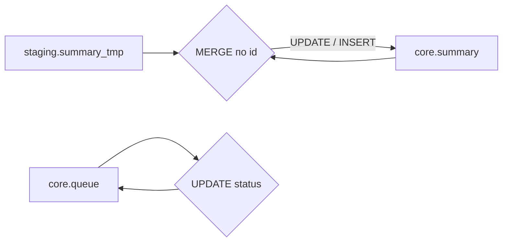

# Блок 05 — поток данных

Применимость — в [template.md](../template.md). Строй граф по reads/writes/calls
**всех** операций реестра. Тип операции не ограничивается INSERT.

1. Добавь физические источники и цели, существенные временные объекты и узлы операций.
2. Для каждой операции проведи reads → операция → writes. Для вызова рисуй отдельную
   пунктирную связь вызова; не приписывай ему запись без определения функции.
3. UPDATE/DELETE могут читать и изменять один объект; покажи это через узел операции.
   MERGE USING направляется в MERGE, ветви направлены в target, а не обратно в USING.
4. TRUNCATE/DDL без входных данных представляются узлом операции и целью.
   Не добавляй выдуманный источник ради отсутствия изолированных узлов.
5. Подпиши значимые фильтры и условия. Условный запуск отличай от безусловного потока.
6. Динамические/неразрешённые объекты помечай явно и связывай с неопределённостями.

Предпочитай Mermaid flowchart LR. Пример формы (не готовая схема проекта):

Не навязывай source → staging → core, если код использует иной поток.
Слои и цвета определяются активным профилем; при цветовой кодировке добавь легенду.
Для большого графа используй обзор и дополнительные схемы по логическим группам.
В небольшой схеме не требуются одновременно два уровня детализации.

Проверь корректность Mermaid доступным рендерером/парсером, если он есть.
Без него не утверждай, что рендеринг проверен. Сверь направления и узлы с реестром.

